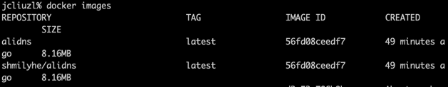
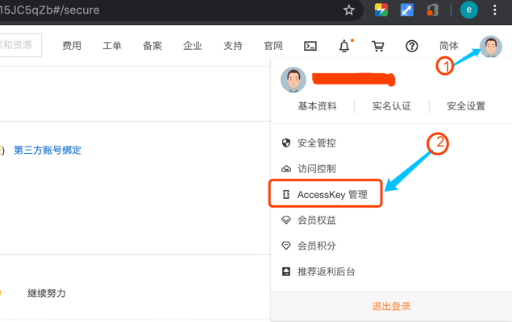
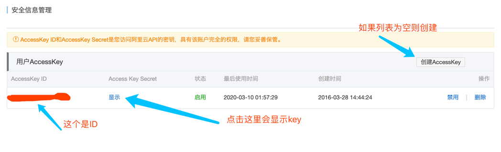
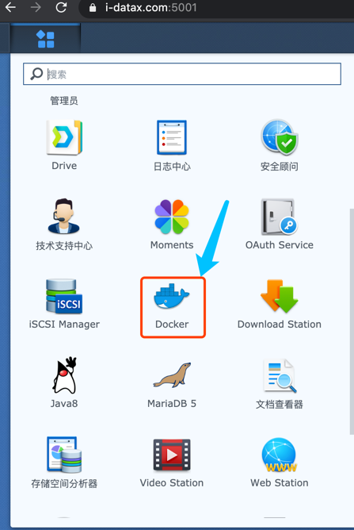
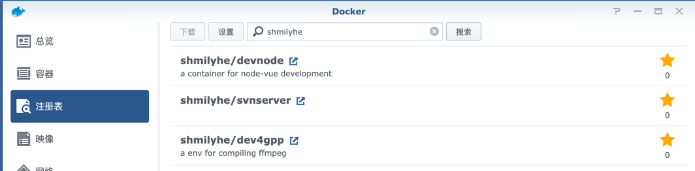
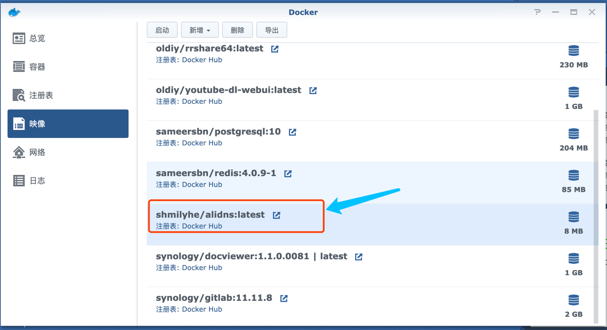
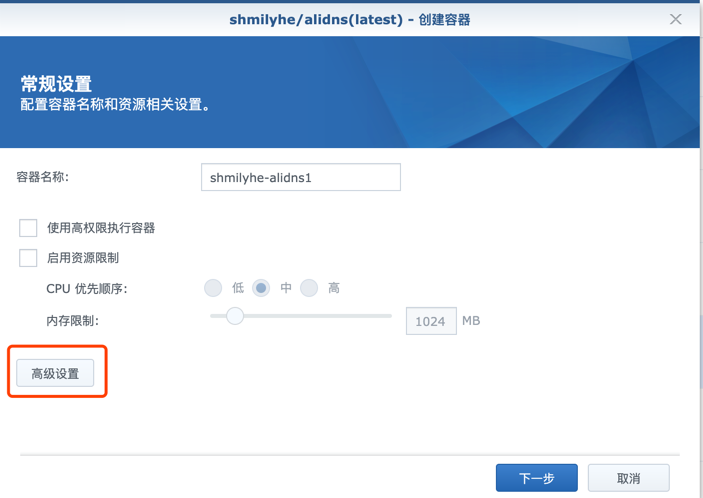
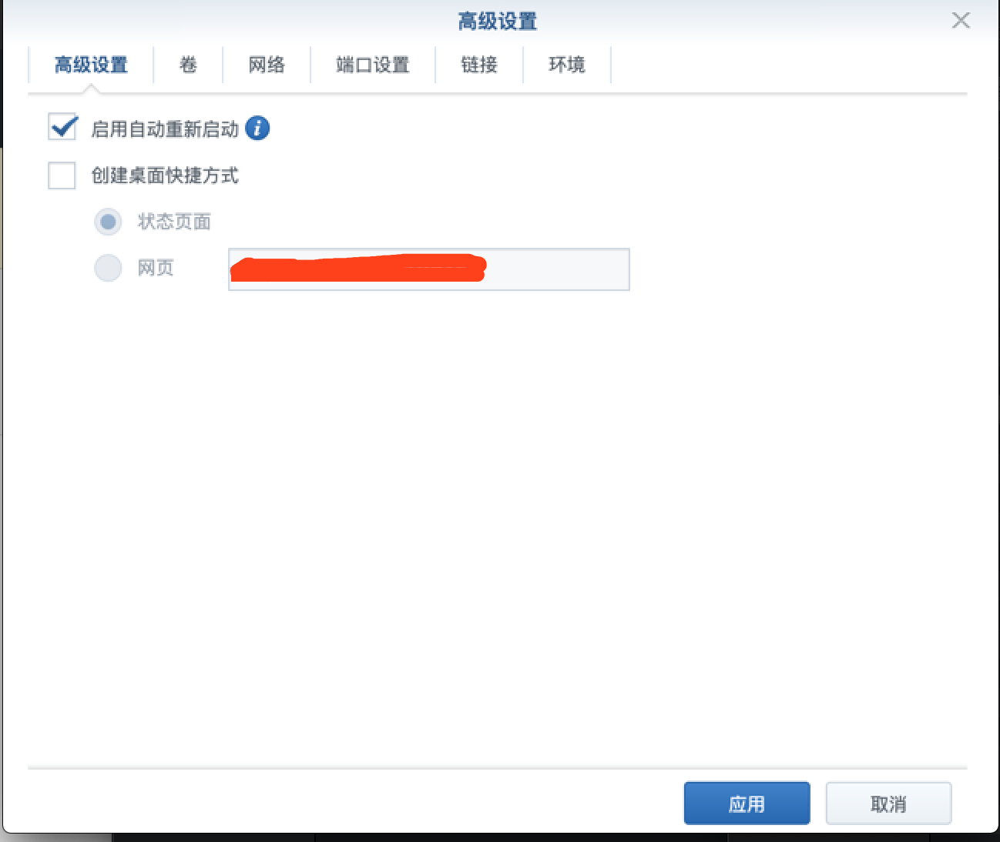
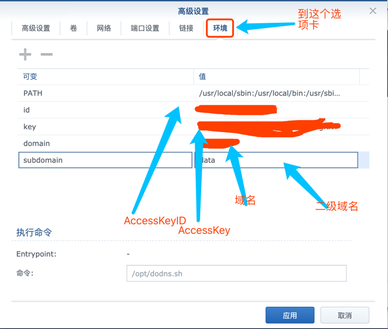
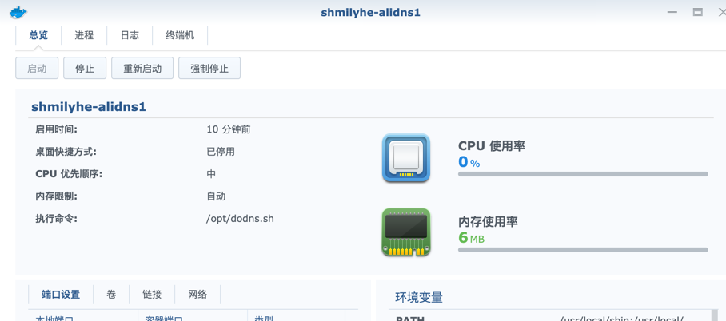

# 阿里的DDNS
现在电信和联通都可以把家里的宽带开通公网IP,为家里的NAS搞个域也挺好。重点是域名不贵，.com的一年也才三四十元，用起来比花生壳高逼格多了。
为此做一个阿里DDNS的docker 镜像，docker hub上也有现成的为什么还自己搞一个呢？
主要是自己打造的东西用起来顺手，更高重要的是这个docker 镜像小呀，才8.16MB.


用法：
命令行

```
docker run --rm -d -e id=阿里的AccessKeyID -e key=阿里的KEY -e domain=域名（如：qq.com） -e subdomain=二级域名（如：ddns）  shmilyhe/alidns
```

## 如何获取阿里的 AccessKeyID 和 key?

1、首先你得要在阿里云上有注册域名，
2、然后登陆进入阿里云控制台
3、然后鼠标移到右上角自己的头像上，就可看到如下界面

4、点击AccessKey 管理
你将看到如下界面，id 和key就在里面

控制台的传送门[https://homenew.console.aliyun.com/](https://homenew.console.aliyun.com/)

## 域名怎么注册？
控制台的传送门[https://wanwang.aliyun.com/](https://wanwang.aliyun.com/)


## 群晖上怎么使用？

1、先打开Docker(前提是你得先装了docker)

2、在注册表中下载 shmilyhe/alidns

3、在映像中找到shmilyhe/alidns

4、双击镜像进入配置界面，点高级配置

5、勾启动自动重新启动，这样开机时它就会自动启动

6、重点来了配置阿里的AccessKey ，到环境这个选项卡中填入相应的值就OK了

像例如：我申请了一个叫datax.com 的域名 想动态解析到nas.datax.com
则域名填 datax.com 二级域名填 nas.  AccessKey 和ID 就按你申请的实际填。这样你就可以直接nas.datax.com 直接访问你的NAS.
7、然后下一步下一步直接到创建完成
8、看看运行的开销才6M，实现不算点内存 



> 提醒一下，外网有风险，要注意开防火墙，不要开高危的端口，如22 和诸如AFP 、NFS 这些端口。


